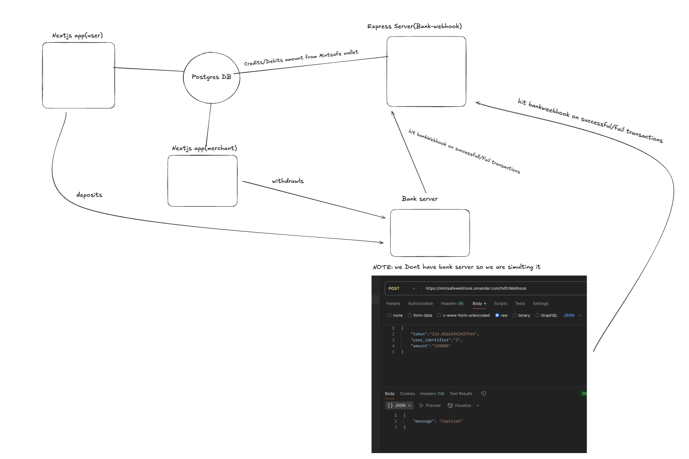

🚀 Just launched a modern payment service built with a blazing-fast Turborepo monorepo architecture!

🔧 Tech Stack:
Frontend: Next.js + Tailwind CSS

Backend: Express.js

DB: PostgreSQL + Prisma

Auth: NextAuth.js + Twilio

DevOps: Docker + CI/CD

Security: Rate Limiting + CAPTCHA

All powered under one roof with Turborepo 🛠️

🧠 Designed for scale, security, and speed.

🔗 Check it out:
MintSafe: https://mint-safe-user-app.vercel.app/
MintSafe Merchant: https://mint-safe-merchant-app.vercel.app/
System Design: https://lnkd.in/d_3jqGVp

#Nextjs #Turborepo #PostgreSQL #Prisma #Docker #Payments #WebDev #IndieHackers #FullStack


# Getting Started Locally

Follow these steps to start the project locally:

1. **Clone the repository**
   ```sh
   git clone <your-repo-url>
   cd <repo-folder>
   npm install
   ```

2. **Start PostgreSQL locally using Docker**
   ```sh
   docker run --name local-postgres -e POSTGRES_PASSWORD=yourpassword -p 5432:5432 -d postgres
   ```

3. **Set up the database connection**
   - Copy your `DATABASE_URL` and paste it into the `.env` file inside `packages/db`.

4. **Run Prisma commands in `packages/db`**
   ```sh
   cd packages/db
   npx prisma migrate dev
   npx prisma generate
   npx prisma db seed
   ```

5. **Add a `.env` file to `apps/user-app`** and `apps/merchant-app`

Create a file named `.env` inside the `apps/user-app` directory and `apps/merchant-app`:

```
NEXTAUTH_URL="http://localhost:3001"
JWT_SECRET="your_jwt_secret"
TWILIO_SERVICE_SID="your_twilio_service_sid"
TWILIO_SID="your_twilio_sid"
TWILIO_AUTH_TOKEN="your_twilio_auth_token"
GITHUB_CLIENT_ID="your_github_client_id"
GITHUB_CLIENT_SECRET="your_github_client_secret"
UPSTASH_REDIS_REST_URL="your_upstash_url"
UPSTASH_REDIS_REST_TOKEN="your_upstash_token"
NEXT_PUBLIC_TURNSTILE_SITE_KEY="your_turnstile_site_key"
TURNSTILE_SECRET_KEY="your_turnstile_secret_key"

```

6. **Go back to the root directory**
   ```sh
   cd ../..
   ```

7. **Start the development server**
   ```sh
   npm run dev
   ```

Your application should now be running now🚀


